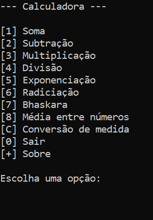
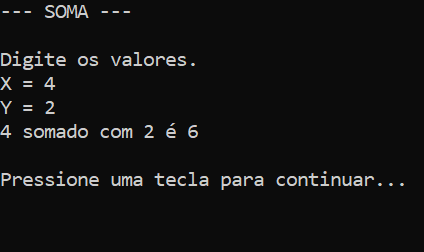

# Projeto Prático - Calculadora
Projeto final (1I3)

Este programa exibe um menu com opções para cálculos matemáticos básicos, exponenciação, radiciação, bhaskara, média entre números e conversão de unidade. O usuário, ao selecionar uma opção, pode realizar os cálculos e obter os resultados.

---


## _Screenshot_



### Exemplo - opção 1:


 
 ---

## _Download_

Baixe o arquivo abaixo. Descompacte na pasta de sua escolha.

[🐻 Download do arquivo .zip](dist/Projeto---Calculadora.zip)

Execute utilizando o comando:
```
dotnet Projeto---Calculadora.dll
```
---

## Agradecimentos 

- [Etec Adolpho Berezin](http://eteab.com.br/cms/)
- [Prof. Ermogenes](https://github.com/ermogenes)
- [Prof. Diego Neri](https://github.com/diegoneri)
- [Dev C#](https://github.com/ermogenes/aulas-programacao-csharp)

---